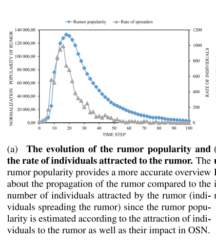
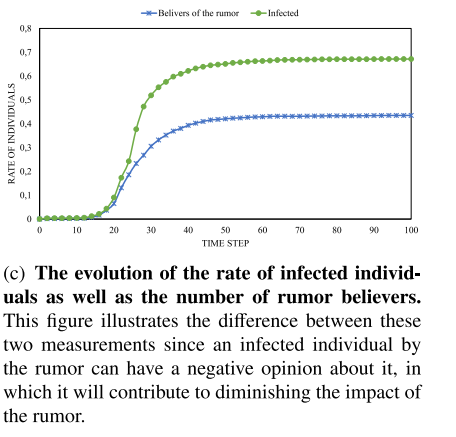
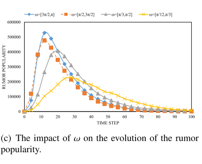

```{r results='hide',echo=FALSE}
library(igraph)
library(ggplot2)
show_code_a<-F
show_code_b<-F
run_code_a<-F
run_code_b<-T
```

# 目前状态总结

## 当前研究思路

1. 进行rumor的仿真模拟（包含群体对rumor的观点变化），得到与参考文献类似的图形，以验证仿真程序的准确性（已完成）
2. 改变参数（包括外在因素：rumor的质量P，内在因素：网络中中心节点知识背景$\beta$等,），进行大量实验（下一步）
3. 对实验结果统计分析，与突变模型进行拟合，并结合已知的弹性文献，得到合适的弹性模型。（之后）
4. 找到现实的案例进行结合说明（如重庆公交坠桥，女司机被网民造谣事件）

2和3预计需要一周时间。

## 当前研究的创新点

1. 多层网络的设计（以达到）
2. 观点交互的RA模型与rumor传播结合（以达到）
3. 运用突变进行研究，得到弹性模型（下一步目标）


## 之后研究思路

1. 在仿真模型中，有不同的观点交互模型，可以选择新的观点模型进行验证
2. 选择现实中的网络进行仿真，确保与现实的结合

# 谣言的传播 

传播模型的来源[@hosni2020minimizing]。

## 个人对于谣言的兴趣程度

1. 个人对谣言感兴趣的程度随着时间的增加而呈现波浪形的衰退，由以下公式表示

$$A(t)=A_{int}e^{-\beta t}cos(\omega t + \delta) \tag{1}$$

其中$A(t)$是$t$时刻个人对谣言感兴趣的程度，$A_{int}$是初始的感兴趣程度，$\beta$是个人的文化程度背景，$\omega$是个人的遗忘因素，每个人的记忆能力不同，$\delta$是的对于谣言的源头的信任程度，决定了犹豫机制。

## 个人对谣言的观点

1. 谣言被分为四类：否认，中立，质疑，支持。我们引入个人$v$对谣言的看法$B_v$,$B_v\in(-\infty,0]$代表了否认，$B_v\in[0,10]$代表了中立，$B_v\in[10,20]$代表了质疑，$B_v\in[20,\infty]$代表了支持。由此文献支持[@wang2017rumor]，展现了人们会出现一种类似牛群的心态，这种心态使人们盲目跟随他人，借用他们的意见。但是，当个人多次收到相同的信息时，由于信息冗余，对个人的影响可能不会像最初那样大[@ma2016rumor]。所以个人针对谣言的观点定义如下：
$$
B_v(t)=\sum_{u\in \mathbb{N}^v}\sum_{j=1}^{n} { \frac{B_u(t-1)}{j}}, \quad for \quad t>0   \tag{2}
$$
其中$\mathbb{N}^v$是个体$v$的邻居节点的集合，$n$是个体$v$受到单个邻居影响的次数。

2. 可以使用的验证数据有重庆公交车坠河与女司机被人肉。此文[@zeng2019model]进行了分析。
3. 本次模型使用了RA模型进行观点的交互。

## 谣言传播规则

1. 本节的重点在谣言如何在多个在线社交网络（online social networks，OSNs）进行传播，关注了人机交互，主要回答了以下问题：谣言什么时候被发送？什么时候会被接受？会在哪一层网络被发送？
2. 带有$n$个网络的OSNs由$\mathbb{G}^n=(I,G^n)$表示，其中$I=(V,C)$代表了个体集；对于每个个体来说，$i\in I$由以下两个内容表示，即$v\in V$节点和$c\in C$个性。个性决定了每个人对于谣言的不同反应，具体可参考 1.1。集合$G^n=\{ G_1=(V,E_1),\quad G_2=(V,E_2), \quad G_3=(V,E_3),...,G_n=(V,E_n) \}$是$n$个网络的集合，其中$G_i=(V,E_i)$是代表网络的有向图。如果$v\in G_i$但是$v\notin G_j$，那么$v$在$G_j$中就是孤立的点。
3. 谣言的传播经过了以下三个步骤：选择某个网络的概率，发布谣言的概率，接受谣言的概率。
4. 由于大多数人喜欢自己受到别人关注，我们认为个体$u$在网络$k$进行发布的概率取决于他在网络$k$的in-degree，所以在$\mathbb{G}^n$中选择网络$k$的概率为
$$
p^k_u={\frac {d^k_{in}(u)}{\sum^n_{i=1}d^i_{in}(u)}} \tag{3}
$$
其中$d^i_{in}(u)$代表了个体$u$在第$i$层网络的in-degree。
5. 发布谣言的概率，这个概率与个人教育背景，遗忘因素，犹豫机制，如果个人越对谣言感兴趣，就越可能发布，所以用${ {A(t)}/{A_{int}}}$表示，在$t$时刻的概率如下：
$$
p^{send}_{u}(t)=e^{-\beta t}|sin(\omega t+\delta)| \tag{4}
$$
6. 接受的概率。我们认为个体具有更高的in-degree，影响力越大[@kempe2003maximizing]，但是具有高in-degree的个体不容易受到影响，所以在$k$层发送者$u$和接受者$v$接受概率的公式如下
$$
p^{acc}_{v,u}={\frac {1}{1+d^k_{in}(v)/d^k_{in}(u)}}.P \tag{5}
$$
$P$为传播过程中的概率参数。
7. 两个节点$u,\quad v$在$k$层的谣言传播概率如下：
$$
p^k_{u,v}(t)=p^k_u.p^{send}_u(t).p^{acc}_{u,v} \tag{6}
$$

## 谣言的传播过程

1. 在时间$t=0$，一些个体会在$\mathbb{G}^n$的不同层中散播谣言，这些个体对谣言有着不同的观点（opinion），其他的个体对这件事不知情。在此过程中，如果有无知的个体根据公式$(6)$接受谣言，他们也会成为传播者，行为会遵循公式$(1)$，
2. 每个时间点有人接受了谣言，接受者针对谣言的观点就会根据公式$(2)$进行更新。个人可以接受多个谣言，但是只能传递每个接受的谣言一次。当参与者对谣言的兴趣消退时，便不会参与传播过程。
3. 当谣言的人气恶化时，传播过程就结束了。在传播过程中，即$R(t)\simeq 0$。具体表达如下，其中$R_i(t)$表示了第$i$层累计的吸引力（考虑个人的权威程度）。
$$
R(t)=\sum_{i=1}^nR_i(t)\quad where \quad R_i(t)=\sum_{v\in V}A_v(t).d_{in}^i(v) \tag{7}
$$


## 参数的确定
1. $\beta\in[0.2,1.2]$, $\omega\in[\pi/12,\pi]$,$\delta\in[\pi/24,\pi/2]$
2. 初始有10个节点被选择成为传播者，其观点也是随机的正或负

## 衡量的指标

1. 传播者的数量的变化
2. 谣言传播情况（最后感染谣言的人数）
3. 谣言人气的衡量，如公式$(7)$所示。
4. 对谣言有正面（负面）法的人数的演变。
5. 谣言的影响，感染的人数并且没有负面观点的人数。

## 目标

1. 限制谣言的传播
2. 增加不信任谣言的人数

## 说明

这篇文章提出的谣言的人气是新的衡量谣言演变的工具。

# 有向网络的传播

## 建立网络

```{r results='hide',echo=show_code_a,include=FALSE,eval=run_code_a}
# 得到每个节点的进度节点，返回向量
get_in_degree<-function(g,n=1,mode="in"){
  k<-ego(g,n,seq(length(V(g))),mode = mode)
  # 以下注释为不含自身的进度
  # for (i in seq(length(V(g)))) {
  #   k[[i]]<-k[[i]][-which(k[[i]]==i)]
  # }
  return(k)
}
# 得到每个节点的进度节点的数量
get_in_num<-function(k){
  b<-NULL
  for(i in seq(k)){
    b<-c(b,length(k[[i]]))
  }
  return(b)
}
# 得到接受概率
get_acc<-function(num_node,d,p_set){
  p_acc<-matrix(rep(0,num_node*num_node),nrow = num_node)
  for(i in seq(num_node)){
    p_acc[i,]<-(1/(1+(d[i]/d)))*p_set
  }
  return(p_acc)
}

# 得到个体在接受rumor后的发布概率
get_p_send<-function(i,t,time_step){
  # 自接受之日起，之后的时间
  if(t==0.5){
    t=0
    }
  all_t<-c((t+1):time_step)-t
  p<-abs(exp(-1*id_all[i,1]*all_t)*sin(id_all[i,2]*all_t+id_all[i,3]))
  return(p)
}
# 使用的ra模型
ra_mode<-function(op_1,op_2,u_1,bg){
  if(abs(op_1-op_2)>u_1){
    return(op_1)
  }else{
    return(op_1+bg*abs(op_1-op_2))
  }
}

```


1. 使用BA模型建立无标度网络，规模设置为1000，个数为3.

```{r echo=show_code_a,eval=run_code_a}
# num_node 节点node的数量
num_node<-1000
seed<-c(1:100)
set.seed(seed[1])
g1 <- sample_pa(num_node)
set.seed(seed[2])
g2 <- sample_pa(num_node)
set.seed(seed[3])
g3 <- sample_pa(num_node)

```

2. 计算每个节点的in-degree

```{r echo=show_code_a,eval=run_code_a}
# k 序列，每个graph的节点的in-degree详情
k1<-get_in_degree(g1)
k2<-get_in_degree(g2)
k3<-get_in_degree(g3)

# k_all ,节点的邻居
k_all1<-get_in_degree(g1,mode = "all")
k_all2<-get_in_degree(g2,mode = "all")
k_all3<-get_in_degree(g3,mode = "all")
k_all<-list(k_all1,k_all2,k_all3)
k_all4<-list()
for(i in seq(num_node)){
    n_o1<-as.numeric(k_all[[1]][[i]])
    n_o2<-as.numeric(k_all[[2]][[i]])
    n_o3<-as.numeric(k_all[[3]][[i]])
    k_all4[[i]]<-union(n_o1,union(n_o2,n_o3))
}


# d 矩阵，每个graph的节点的进度数量,d[i,j]为个体i在网络j的进度数量,
# 最后一列为进度总数
d<-matrix(rep(0,num_node*(3+1)), nrow = num_node, ncol = 4)
d[,1]<-get_in_num(k1)
d[,2]<-get_in_num(k2)
d[,3]<-get_in_num(k3)
d[,4]<-d[,1]+d[,2]+d[,3]

```

## 给个体分配属性

```{r echo=show_code_a,eval=run_code_a}
id_all<-matrix(rep(0,num_node*3),ncol = 3)
set.seed(100)
# beta
id_all[,1]<-runif(num_node,0.2,0.8)
set.seed(100)
# omega
id_all[,2]<-runif(num_node,pi/12,pi/2)
set.seed(100)
# delta
id_all[,3]<-runif(num_node,pi/24,pi/3)

```

## 看法以及感兴趣程度

```{r echo=show_code_a,eval=run_code_a}
# time_step 实验的时间数，步数; 

time_step<-500
a_int<-10
# a[i,j]为个体i在时间j对谣言的感兴趣程度
a<-matrix(rep(0,time_step*num_node),ncol = time_step)
# b[i,j]为个体i在时间j对谣言的观点，opinion
b<-matrix(rep(0,time_step*num_node),ncol = time_step)
# b_u[i]个体i的不确定性
b_u<-runif(num_node,0,0.4)
```

## 计算不同概率的公式

1. 选择在网络上发布的概率
```{r echo=show_code_a,eval=run_code_a}
# 不同个体选择在哪个网络发布的概率,
# p_net[i,j]为个体i在网络j发布的概率

p_net<-matrix(rep(0,3*num_node),nrow = num_node,ncol = 3)
p_net[,1]<-d[,1]/d[,4]
p_net[,2]<-d[,2]/d[,4]
p_net[,3]<-d[,3]/d[,4]

# p_net2 区间概率
p_net2<-t(apply(p_net,1,cumsum))
```

2. 发布谣言的概率

```{r echo=show_code_a,eval=run_code_a}
# p_send[i,j]是个体i在时间j发布的概率
p_send<-matrix(rep(0,time_step*num_node),nrow = num_node)

```

3. 接受谣言的概率
```{r echo=show_code_a,eval=run_code_a}
# p_set为模型中的P,设定的概率参数
p_set<-2
# p_acc1[i,j]为接受者i，发送者v的接受概率
# p_acc1<-matrix(rep(0,num_node*num_node),nrow = num_node)
# for(i in seq(num_node)){
#   p_acc1[i,]<-(1/(1+(d[i,1]/d[,1])))*p_set
# }
p_acc1<-get_acc(num_node,d[,1],p_set)
p_acc2<-get_acc(num_node,d[,2],p_set)
p_acc3<-get_acc(num_node,d[,3],p_set)
# p_acc为多个矩阵的集合，方便计算
p_acc<-list(p_acc1,p_acc2,p_acc3)

```


# 传播过程

```{r echo=show_code_a,eval=run_code_a}
# 初始接受的点
set.seed(100)
kk<-sample(seq(num_node),size = 10)  
# 初始成员的观点opinion
b[kk,1]<-runif(10,-1,1)
# kk<-c(1,2,3,4,10,14,56,108)
# acc_i   个体是否接受rumor,0为不接受，
#        0.5为初始点，其他数字为接收时间点
acc_i<-rep(0,num_node)
acc_i[kk]<-0.5
# acc_n 接受的次数
acc_n<-rep(0,num_node)
acc_n[kk]<-1
# 个体是否发布，0为未发布，其他数字为发布的时间点
spend_i<-rep(0,num_node)
# 得到初始节点之后时间点的发布概率
for(i in kk){
  p_send[i,]<-get_p_send(i,0,time_step)
}
# sender_t[t] t时间的传播者数量
sender_t<-rep(0,time_step)

for(t in seq(time_step-10)){
  # 接受谣言的个体
  ra_i<-which(acc_i>0)
  # # 未发布谣言的个体
  # us_i<-which(spend_i==0)
  us_i<-seq(num_node)
  # 取交集，得到发布的个体
  spend_t<-intersect(ra_i,us_i)
  # 发布者数量的计数
  s_t<-0
  for(ii in spend_t){
    # 是否发布
   # browser()
    if(runif(1)<p_send[ii,t]){
      s_t<-s_t+1
      spend_i[ii]<-t
      # 选取网络层数
      s_net<-which(p_net2[ii,]>runif(1))[1]
      # 收集友邻
      aaa<-as.numeric(k_all[[s_net]][[ii]])
      # 随机数
      pp<-runif(length(aaa))
      # 接受rumor的个体
      # aci<-which(pp<p_acc[[s_net]][aaa,ii])
      aci<-aaa[which(pp<p_acc[[s_net]][aaa,ii])]
      ra_ii<-which(acc_i>0)
      # 接受的次数
      acc_n[aci]<-acc_n[aci]+1
      acc_i[setdiff(aci,ra_ii)]<-t
      for(ia in setdiff(aci,ra_ii)){
        p_send[ia,c((t+1):time_step)]<-get_p_send(ia,t,time_step)
      }
    }
  }
  sender_t[t]<-s_t
  # 得到观点opinion
  if(t>1){
    ra_ii<-which(acc_i>0)
    ra_it<-which(acc_i<t)
    ra_ii<-intersect(ra_ii,ra_it)
    for (i_o in ra_ii) {
      # 计算得到所有的邻居
      # n_o1<-as.numeric(k_all[[1]][[i_o]])
      # n_o2<-as.numeric(k_all[[2]][[i_o]])
      # n_o3<-as.numeric(k_all[[3]][[i_o]])
      # n_o<-union(n_o1,union(n_o2,n_o3))
      n_o<-k_all4[[i_o]]
      # 邻居且接受rumor的
      n_o<-intersect(n_o,ra_ii)
      if(b[i_o,(t-1)]==0){
        b[i_o,t]<-id_all[i_o,1]*runif(1,-1,1)+(1-id_all[i_o,1])*mean(b[n_o,(t-1)])
        # b[i_o,t]<-ifelse(runif(1)<(1/(1+id_all[i_o,1])), ifelse(runif(1)<0.5,max(b[n_o,(t-1)]),min(b[n_o,(t-1)])), mean(b[n_o,(t-1)])) 
        # b[i_o,t]<-mean(b[n_o,(t-1)])/(1+id_all[i_o,1]) 
      }else{
        # n_oo<-intersect(as.numeric(k_all[[1]][[i_o]]),ra_ii)
        # op_now<-sum(p_acc[[1]][i_o,n_oo]*b[i_o,(t-1)])
        # n_oo<-intersect(as.numeric(k_all[[2]][[i_o]]),ra_ii)
        # op_now<-sum(p_acc[[1]][i_o,n_oo]*b[i_o,(t-1)])+op_now
        # n_oo<-intersect(as.numeric(k_all[[3]][[i_o]]),ra_ii)
        # op_now<-sum(p_acc[[1]][i_o,n_oo]*b[i_o,(t-1)])+op_now
        # b[i_o,t]<-b[i_o,(t-1)]+op_now
        # RA模型
        b[i_o,t]<-ra_mode(b[i_o,(t-1)],mean(b[n_o,(t-1)]),b_u[i_o],id_all[i_o,1])
        # b[i_o,t]<-ifelse(runif(1)<(1/(1+id_all[i_o,1])), ifelse(runif(1)<0.5,max(b[n_o,(t-1)]),min(b[n_o,(t-1)])), mean(b[n_o,(t-1)]))
        # b[i_o,t]<-id_all[i_o,1]*b[i_o,(t-1)]+(1/id_all[i_o,1])*mean(b[n_o,(t-1)])
      }
    }
  }
}
```


# 结果的指标统计

## 传播者/接受者的数量变化

```{r echo=F}
# 图片是否在中间
fig_a<-"center"
# 图片的高宽比，高/宽
fig_asp<-1
# 图片的宽度 3.2 可以放两个，
fig_w1<-4
fig_w2<-3
out_w1<-'30%'
out_w2<-'60%'
q12<-"echo=show_code_b,eval=run_code_b,fig.align=fig_a,out.width=out_w1"
# 是否load已有数据
if(run_code_a==F){
  load("first.Rdata")
}
```


```{r testFigure, fig.cap="仿真图形",echo=show_code_b,eval=run_code_b,fig.align=fig_a,out.width=out_w1}

# 由于后期的数据大都为0或变化很小，选择部分前期的数据
t_end<-100
# 不同时期传播者的数量绘图
s_data1<-data.frame(time=c(1:t_end),number=sender_t[1:t_end])
qplot(time,number,data=s_data1,geom="line",col="red")
# # 不同时期接受者的数量绘图----
# bb<-sort(unique(acc_i))
# if(bb[1]==0){
#   bb<-bb[-1]
# }
# bb[1]<-0
# bc<-NULL
# for(i in seq(bb)){
#   bc<-c(bc,length(which(acc_i==bb[i])))
# }
# s_data2<-data.frame(time=bb,number=bc)
# qplot(time,number,data=s_data2,geom="line",col="green")
# # geom_line(data=s_data2,aes(x=time,y=number,color="green"),size=1)
# # points(bb,bc)
# # lines(bb,bc)
# ----
```

1. 这是根据仿真模型得到的图\@ref(fig:testFigure) 所示

2. 这是参考文献的图

```{r fig.cap="参考文献" ,echo=show_code_b,eval=run_code_b,fig.align=fig_a,out.width=out_w1}

```

## rumor传播情况（感染人数）

1. 模型的图形

```{r fig.cap="仿真图形传播情况",echo=show_code_b,eval=run_code_b,fig.align=fig_a,out.width=out_w1}
ca<-c(0:t_end)
cb<-rep(0,(t_end+1))
for(i in seq(bb)){
  cb[(bb[i]+1)]<-bc[i]
}
cc<-cumsum(cb)
g_data<-data.frame(time=ca,number=cc/num_node)
qplot(time,number,data=g_data,geom="line",col="red")
# plot(ca,cc)
# lines(ca,cc)
```

2. 参考文献的图形

```{r fig.cap="参考文献传播情况" ,echo=show_code_b,eval=run_code_b,fig.align=fig_a,out.width=out_w1}

```


## rumor人气的衡量

1. 模型计算

```{r fig.cap="仿真图形人气",echo=show_code_b,eval=run_code_b,fig.align=fig_a,out.width=out_w1}
a<-p_send*a_int
# a_all[t,i] 网络层i在时间t的人气值
a_all<-matrix(rep(0,time_step*4),ncol = 4)
for (i in c(1,2,3)) {
  for(ii in seq(time_step)){
    a_all[ii,i]<-sum(a[,ii]*d[,i])
  }
}
a_all[,4]<-a_all[,1]+a_all[,2]+a_all[,3]
po_data<-data.frame(time=c(1:t_end),number=a_all[1:t_end,4])
qplot(time,number,data=po_data,geom="line",col="red")
# plot(c(1:t_end),a_all[1:t_end,4])


```

2. 参考文献图形


```{r fig.cap="参考文献人气" ,echo=show_code_b,eval=run_code_b,fig.align=fig_a,out.width=out_w1}

```


## 群体关于谣言的观点

```{r echo=show_code_b,eval=run_code_b,fig.align=fig_a,out.width=out_w1}

op_psum<-function(m){
    return(sum(m[which(m>0)]))
}
op_nsum<-function(m){
    return(sum(m[which(m<0)]))
}
op_pnum<-function(m){
    return(length(which(m>0)))
}
op_nnum<-function(m){
    return(length(which(m<0)))
}
op_p<-apply(b, 2, op_psum)
op_n<-apply(b, 2, op_nsum)
op_pn<-apply(b, 2, op_pnum)
op_nn<-apply(b, 2, op_nnum)
op_b<-colSums(b)

op_data<-data.frame(time=c(1:100),op_b=op_b[1:100],op_p=op_p[1:100],op_n=op_n[1:100],op_pn=op_pn[1:100],op_nn=op_nn[1:100])

# 
# # 加和之后的观点走向
# plot(c(1:100),op_b[1:100])
# # 大于0的整体观点走向
# plot(c(1:100),op_p[1:100])
# # 小于0的整体观点走向
# plot(c(1:100),op_n[1:100])
# 
# # 大于0的人数统计
# plot(c(1:100),op_pn[1:100])
# # 小于0的人数统计
# plot(c(1:100),op_nn[1:100])

```

1. 总体观点的统计（每一时刻的观点加和）

```{r fig.cap="仿真图形总体观点",echo=show_code_b,eval=run_code_b,fig.align=fig_a,out.width=out_w1}
qplot(time,op_b,data = op_data,xlab="time",ylab="opinion",geom="line")
```

2. 以0为分界线，对观点统计（每一时刻大于0的进行统计或小于0的进行统计）

```{r fig.cap="仿真图形观点",echo=show_code_b,eval=run_code_b,fig.align=fig_a,out.width=out_w1,fig.show='hold'}
qplot(time,op_p,data = op_data,xlab="time",ylab="opinion",geom="line")
qplot(time,op_n,data = op_data,xlab="time",ylab="opinion",geom="line")
```

3. 以0为分界线，对观点人数统计（每一时刻大于0的人数进行统计或小于0的人数进行统计）

```{r fig.cap="仿真图形观点人数",echo=show_code_b,eval=run_code_b,fig.align=fig_a,out.width=out_w1,fig.show='hold'}
qplot(time,op_p,data = op_data,xlab="time",ylab="opinion",geom="line")
qplot(time,op_n,data = op_data,xlab="time",ylab="opinion",geom="line")
```

## rumor影响，感染人数

1. 模型计算
```{r  echo=show_code_b,eval=run_code_b}
length(which(acc_i>0))
length(which(acc_i>0))/num_node

```


# 参考文献


